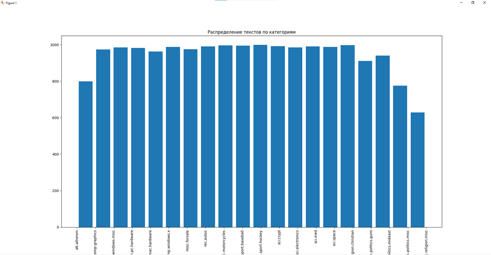
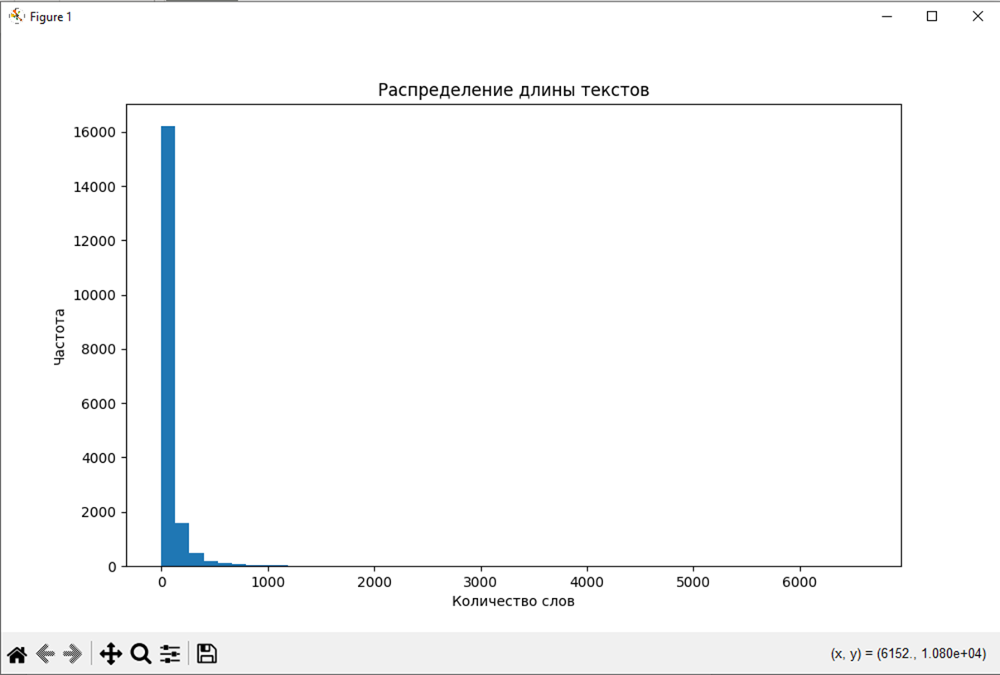
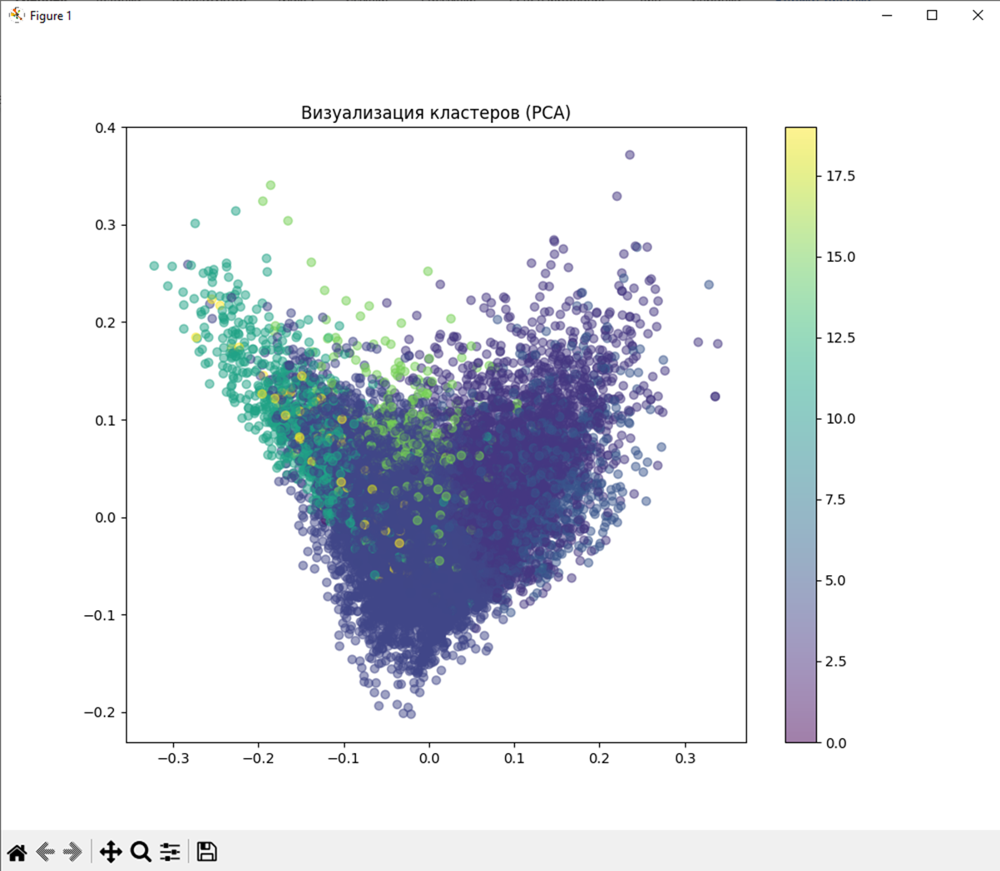

## Great Analizationiro

Заметим, что данные распределены равномерно на значении 1000. Однако заметим несколько аутсайдеров, например misc и atheizm

По длине, мы можем наблюдать абсолютную доминацию значения 16000

На сколько можно судить, данная машина смогла разделить данные на кластеры

# great console output
Количество текстов: 18846
Количество категорий: 20

Adjusted Rand Index: 0.030
Silhouette Score: -0.009
Train size: 13192
Val size: 2827
Test size: 2827
